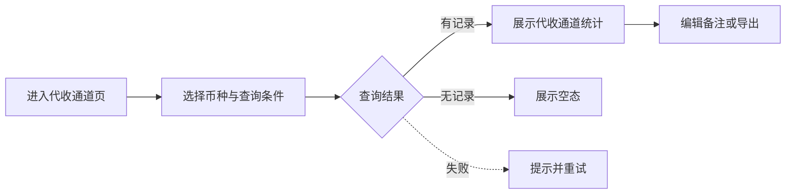
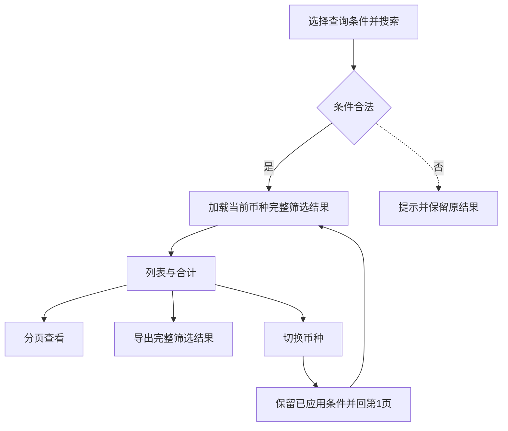
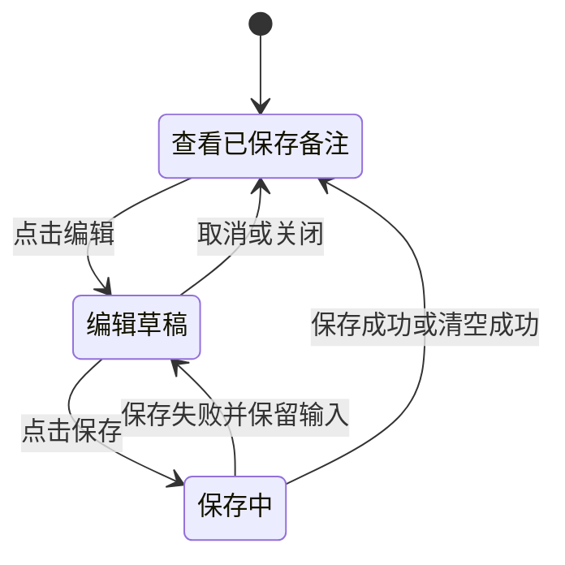
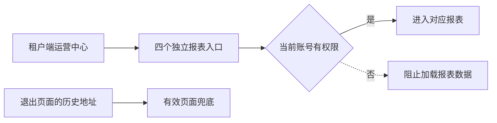
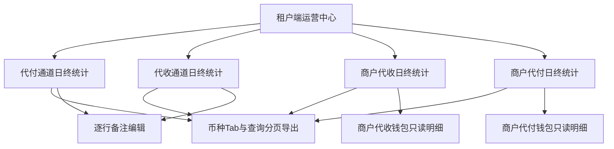

# 汇盛支付租户端日终统计报表

## 目录

- [§1 需求说明](#1-%E9%9C%80%E6%B1%82%E8%AF%B4%E6%98%8E)
- [§2 背景与目标](#2-%E8%83%8C%E6%99%AF%E4%B8%8E%E7%9B%AE%E6%A0%87)
- [§3 功能清单](#3-%E5%8A%9F%E8%83%BD%E6%B8%85%E5%8D%95)
- [§4 功能细节规格](#4-%E5%8A%9F%E8%83%BD%E7%BB%86%E8%8A%82%E8%A7%84%E6%A0%BC)
- [§5 功能流程图](#5-%E5%8A%9F%E8%83%BD%E6%B5%81%E7%A8%8B%E5%9B%BE)
- [§6 功能结构图](#6-%E5%8A%9F%E8%83%BD%E7%BB%93%E6%9E%84%E5%9B%BE)
- [§7 页面设计](#7-%E9%A1%B5%E9%9D%A2%E8%AE%BE%E8%AE%A1)
- [§8 异常与边界](#8-%E5%BC%82%E5%B8%B8%E4%B8%8E%E8%BE%B9%E7%95%8C)
- [§9 验收清单](#9-%E9%AA%8C%E6%94%B6%E6%B8%85%E5%8D%95)

## 本文件使用说明

- 本文为需求草稿，描述本期交付范围与业务验收标准。
- 数据与权限边界、资料流和开发核对项见 [PRD_租户端日终统计报表_20261005_appendix](PRD_%E7%A7%9F%E6%88%B7%E7%AB%AF%E6%97%A5%E7%BB%88%E7%BB%9F%E8%AE%A1%E6%8A%A5%E8%A1%A8_20261005_appendix.md)。
- 执行拆分见 [开发任务清单](%E5%BC%80%E5%8F%91%E4%BB%BB%E5%8A%A1%E6%B8%85%E5%8D%95.md)；指标与钱包接入边界见 [开发补充说明](%E5%BC%80%E5%8F%91%E8%A1%A5%E5%85%85%E8%AF%B4%E6%98%8E.md)。
- 交互参考：[汇盛本地统一 Demo](https://jeffcity.github.io/huisheng-pay-demo/#tenant) → 租户端 → 运营中心。

## §1 需求说明

- 在租户端运营中心提供四个独立页面：代付通道日终统计、代收通道日终统计、商户代收日终统计、商户代付日终统计。
- 交易统计按蓝盛对应四页的计算方式移植；展示字段、钱包内容及交互按本需求实施。
- 四页均按币种 Tab 查看，不显示序号。两个通道报表支持逐条编辑备注。
- 运营中心仅保留上述四个统计入口；原经营报表和资金中心日终报表退出当前入口。

### 本次不包含

- 通道报表的服务费、代理费、利润；商户报表的商户服务费、通道服务费。
- 当日流水跳转、订单处理、钱包资金操作、跨币种换算及跨币种合计。
- 新增成交率算法、未支付／未成交状态分类、退款统计栏位、币种业务授权或历史资金调整。

## §2 背景与目标

| 项目 | 说明 |
|---|---|
| 使用者 | 有当前租户报表权限的运营、财务及其他已授权账号 |
| 通道视角 | 按日期、商户和通道查看代收／代付交易结果，并记录运营备注 |
| 商户视角 | 按日期、商户查看交易结果及对应业务钱包的期初、期末余额 |
| 数据范围 | 仅当前租户所属商户和授权币种，不提供租户切换 |
| 达成结果 | 四页可查询、分币种分页、查看完整筛选合计及导出；商户钱包明细在当前页只读查看 |

## §3 功能清单

| 分组 | 页面或能力 | 本期内容 |
|---|---|---|
| 3.1 [NEW] | 代付通道日终统计 | 代付通道交易结果及可编辑备注 |
| 3.2 [NEW] | 代收通道日终统计 | 代收通道交易结果及可编辑备注 |
| 3.3 [NEW] | 商户代收日终统计 | 商户代收交易结果、代收钱包日终余额及只读明细 |
| 3.4 [NEW] | 商户代付日终统计 | 商户代付交易结果、代付钱包日终余额及只读明细 |
| 3.5 [NEW] | 币种 Tab、查询、分页和导出 | 四页共用交互，各币种独立统计与导出 |
| 3.6 [NEW] | 通道备注编辑 | 保存、取消、清空；已保存内容跟随记录并进入导出 |
| 3.7 [MOD] | 租户端报表入口 | 运营中心四页入口；原经营报表、资金中心日终报表退出当前导航。现状参考 [需求背景与确认范围](README.md#需求背景与确认范围) |

## §4 功能细节规格

### 4.1 代付通道日终统计

- 入口：租户端 → 运营中心 → 代付通道日终统计。
- 页面依次展示标题、币种 Tab、筛选区、记录数及数据截至时间、表格、合计和分页。
- 筛选通道仅对应代付方向。每条记录按日期、商户、通道及当前币种区分。

| 顺序 | 字段 | 展示与行为 |
|---|---|---|
| 1 | 日期 | UTC+8 统计日期；按日期倒序展示 |
| 2 | 商户号 | 当前租户所属商户编号 |
| 3 | 商户名称 | 对应商户名称 |
| 4 | 通道名称 | 对应代付通道名称 |
| 5 | 成交金额 | 蓝盛代付通道统计的成交金额，按当前币种展示 |
| 6 | 总单量 | 蓝盛对应统计结果 |
| 7 | 成交率 | 蓝盛对应统计结果，以百分比展示 |
| 8 | 备注 | 空值显示“—”；每条记录提供“编辑”入口 |

- 正常：搜索后展示对应记录；编辑备注按 4.6 执行。
- 异常：查询失败提示原因并允许重试，不把失败呈现为无数据。
- 边界：同一商户、同一天的不同通道为不同记录，备注不得互相覆盖。

### 4.2 代收通道日终统计

- 入口：租户端 → 运营中心 → 代收通道日终统计。
- 布局、字段顺序、备注交互与 4.1 一致；通道和交易统计均限定代收方向。
- 成交金额、总单量、成交率取蓝盛代收通道对应计算，不与代付结果混合。
- 正常：选择代收通道并搜索，展示对应币种的代收结果。
- 异常：查询或备注保存失败时，保留可重试状态，不显示成功提示。
- 边界：同名商户、同日或同币种的代付备注不带入本页。

### 4.3 商户代收日终统计

- 入口：租户端 → 运营中心 → 商户代收日终统计。
- 筛选区按商户查询；每条记录对应当前币种下的一个商户、一个统计日期。

| 顺序 | 字段 | 展示与行为 |
|---|---|---|
| 1 | 日期 | UTC+8 统计日期；按日期倒序展示 |
| 2 | 商户名称 | 当前租户所属商户名称 |
| 3 | 成交金额 | 蓝盛商户代收对应统计结果 |
| 4 | 总单量 | 蓝盛商户代收对应统计结果 |
| 5 | 成功数 | 蓝盛商户代收对应统计结果 |
| 6 | 成交率 | 蓝盛商户代收对应统计结果，以百分比展示 |
| 7 | 代收钱包期初余额 | 该商户、该币种代收钱包的期初总额 |
| 8 | 代收钱包期末余额 | 同一钱包的期末总额；今日为截至查询时总额 |
| 9 | 钱包明细 | 当前页打开只读弹窗，不跳转 |

- 钱包明细按 4.3.1 展示，钱包类型固定为商户代收钱包。
- 正常：查询商户记录，打开明细查看该行日期及币种的钱包快照。
- 异常：钱包快照读取失败时提示并允许重试，不以零余额代替。
- 边界：交易成交金额不等于钱包净变动；钱包总额还包含已记账费用、划转与资金调整。

#### 4.3.1 钱包明细共用规则

| 内容 | 定义 |
|---|---|
| 识别信息 | 商户名称／商户号、统计日期、钱包类型、币种；今日标注截至时间 |
| 期初余额 | UTC+8 该自然日开始时对应钱包的总额 |
| 期末余额 | 历史日为该自然日结束时总额；今日为查询截至时总额 |
| 期末冻结金额 | 与期末余额同一快照时点的冻结金额 |
| 期末可用余额 | 期末余额减期末冻结金额 |

- 明细只供查看；不提供当日流水、钱包或订单跳转，不提供资金操作。
- 点“关闭”、关闭图标或按 Esc 关闭弹窗，返回原报表位置，不改变筛选或页码。
- 钱包类型、归属商户、币种和日期均取所点记录，不能读取当前实时余额来替代历史日快照。

### 4.4 商户代付日终统计

- 入口：租户端 → 运营中心 → 商户代付日终统计。
- 布局、商户筛选和钱包明细规则与 4.3 一致；钱包类型固定为商户代付钱包。

| 顺序 | 字段 | 展示与行为 |
|---|---|---|
| 1 | 日期 | UTC+8 统计日期；按日期倒序展示 |
| 2 | 商户名称 | 当前租户所属商户名称 |
| 3 | 订单总金额 | 蓝盛商户代付对应统计结果 |
| 4 | 成交金额 | 蓝盛商户代付对应统计结果 |
| 5 | 未成交金额 | 蓝盛商户代付对应统计结果，不另设状态分类 |
| 6 | 总单量 | 蓝盛商户代付对应统计结果 |
| 7 | 成功数 | 蓝盛商户代付对应统计结果 |
| 8 | 未支付 | 单量字段，取蓝盛商户代付对应统计结果 |
| 9 | 成交率 | 蓝盛商户代付对应统计结果，以百分比展示 |
| 10 | 代付钱包期初余额 | 该商户、该币种代付钱包的期初总额 |
| 11 | 代付钱包期末余额 | 同一钱包的期末总额；今日为截至查询时总额 |
| 12 | 钱包明细 | 当前页只读弹窗，按 4.3.1 展示 |

- 正常：搜索商户并查看对应代付统计和钱包快照。
- 异常：统计或钱包查询失败分别提示，不把读取失败的字段显示为已确认结果。
- 边界：未支付、未成交金额、成交率的关系由蓝盛计算决定，不使用 Demo 数值反推公式。

### 4.5 币种 Tab、查询、分页和导出

| 区域 | 规则 |
|---|---|
| 币种 Tab | 根据当前租户有效币种显示独立 Tab，不提供“全部币种”合计；初始币种沿用租户端现有默认规则 |
| 切换币种 | 保留已应用的商户／通道及日期条件，切换到目标币种第 1 页；记录数、合计、钱包明细和导出均随之切换 |
| 通道筛选 | 两个通道页面显示“全部渠道”及对应业务方向可查询通道 |
| 商户筛选 | 两个商户页面显示“全部商户”及当前租户所属商户 |
| 统计时间 | 全部时间、今天、昨天、本周、本月；自然日按 UTC+8 计算 |
| 日期范围 | 支持开始／结束日期；修改日期后使用自定义范围；开始日期晚于结束日期时阻止搜索并提示 |
| 搜索 | 应用当前筛选，返回第 1 页，加载记录数及完整筛选合计 |
| 重置 | 清除商户／通道和日期条件，恢复全部时间并返回第 1 页；保留当前币种 |
| 分页 | 默认 10 条／页，可选 20、50 条／页；支持上一页、下一页及指定页码；变更每页条数回第 1 页 |
| 记录数 | 显示当前筛选的记录数与币种；不以当前页行数作为总记录数 |
| 合计 | 仅汇总当前币种、完整已应用筛选结果中的金额及单量字段；不累加成交率或钱包余额，不提供备注合计 |
| 导出 | 导出当前币种、完整已应用筛选结果及对应合计；字段与表格一致，钱包明细按钮不作为数据字段；通道报表包含已保存备注 |

- 金额精度沿用汇盛对应币种规则；不因币种切换进行汇率折算。
- 尚未点击搜索的筛选输入不改变当前列表、合计或导出范围。
- 无数据时显示空态及零条记录，导出不可用；查询失败时显示失败提示。
- 正常：搜索、分页或导出始终使用同一币种与筛选范围。
- 异常：非法页码、日期错误及导出失败分别提示；失败不显示完成提示。
- 边界：快速切换币种时，最终呈现所选币种，不能被上一币种的迟到结果覆盖。

### 4.6 通道备注编辑

- 仅两个通道页面有备注列；商户报表不增加备注列。
- 点行内“编辑”打开弹窗，展示日期、商户名称／商户号、通道和币种，回填已保存备注。
- 提供备注输入框、“保存”“取消”和关闭图标；备注为文本，支持换行。
- 点“保存”成功后关闭弹窗、更新当前行并提示成功；留空保存清空该条备注。
- 点“取消”、关闭图标或按 Esc 关闭时不保存草稿；原备注保留。
- 备注按租户、报表方向、币种、日期、商户及通道归属；筛选、分页、刷新或重新进入后仍读取已保存内容。
- 正常：保存后列表及导出显示已保存内容。
- 异常：保存失败保留原已保存备注和待提交输入，不提示成功，允许重试。
- 边界：更新备注不改变统计金额、单量、钱包余额，也不因统计数据重新生成而被清空。

### 4.7 租户端报表入口

- 运营中心展示四个报表页面名称，进入后标题与导航一致。
- 原经营报表和资金中心日终报表不再出现在当前菜单与页面入口。
- 当前快捷入口、权限页面目录及内部链接同步指向有效页面，不提供可重新打开退出页面的入口。
- 历史地址访问遵守租户端有效页面的路由兜底；不得再次呈现退出页面。
- 正常：从运营中心分别进入四页，可完整返回与继续查询。
- 异常：无权限或失效入口不得加载未授权报表数据。
- 边界：入口调整不改变历史资金事实，也不将租户钱包明细替换成商户钱包报表。

## §5 功能流程图

### 5.1 代付通道日终统计

### 5.2 代收通道日终统计

### 5.3 商户代收日终统计

### 5.4 商户代付日终统计

### 5.5 查询、切币种与导出

### 5.6 备注编辑

### 5.7 报表入口

## §6 功能结构图

## §7 页面设计

### 7.1 代付通道日终统计

- 布局与备注弹窗参考下图；字段顺序以 4.1 为准。
- 备注编辑弹窗居中展示，背景报表维持原查询状态。

### 7.2 代收通道日终统计

- 复用 7.1 布局，标题为“代收通道日终统计”，通道与记录取代收方向。
- 币种 Tab 位于筛选区上方，备注编辑留在当前页面。

### 7.3 商户代收日终统计

- 标题 → 币种 Tab → 商户／时间／日期筛选 → 记录数与截至时间 → 表格／合计 → 分页。
- 表格字段按 4.3 展示；“钱包明细”位于最后一列，横向滚动时仍可操作。
- 弹窗识别信息位于顶部，四项金额分组展示，底部提供“关闭”。

### 7.4 商户代付日终统计

- 使用 7.3 布局，字段顺序以 4.4 为准。
- 宽表支持横向滚动，不挤压或遮挡金额；钱包明细保持可访问。

### 7.5 共用查询区域

- 币种以 Tab 呈现，不重复展示币种下拉筛选。
- 筛选操作使用“搜索”“重置”“导出”；合计与分页分开展示。

### 7.6 备注弹窗

- 标题“编辑备注”，展示该条记录的归属信息、备注文本输入及“取消”“保存”。
- 空备注显示“—”，行内仍保留“编辑”入口；合计行没有备注编辑入口。

### 7.7 导航入口

- 四页归属运营中心，资金中心保留其他既有资金功能入口。
- 本地交互使用唯一统一 Demo；本需求目录不另建可编辑 Demo。

## §8 异常与边界

| 场景 | 可观察结果 |
|---|---|
| 查询返回零条记录 | 展示空态和零条，不展示误导性合计，导出不可用 |
| 开始日期晚于结束日期 | 阻止搜索并提示，原已应用结果不变 |
| 跳转非法页码 | 提示合法范围，原页不变 |
| 单量为零或特殊订单状态 | 使用蓝盛对应计算结果，不增加自行推导规则 |
| 未授权租户／币种／记录 | 不加载、导出或修改其数据 |
| 币种切换与分页并发返回 | 页面最终内容与当前选中币种、当前页一致 |
| 备注取消或关闭 | 已保存内容不变，草稿不进入导出 |
| 备注保存失败 | 原备注保留，输入可继续编辑，无成功提示 |
| 相同商户、日期但通道／币种／方向不同 | 独立统计及备注，不互相覆盖 |
| 钱包金额为零 | 展示有效零值；读取失败或无有效快照不得伪装为零值 |
| 查询历史日 | 读取对应历史快照，不使用当前钱包余额替代 |
| 今日统计 | 显示实际截至时间；金额和钱包快照明确对应其截至时点 |
| 统计数据刷新 | 不覆盖人工已保存备注；不因查询产生资金变动 |
| 导出失败 | 提示失败，允许重试，不提示已完成 |
| 历史入口访问 | 不呈现退出页面，不绕过当前租户权限 |

## §9 验收清单

### 9.1 功能验收

| 验收对象 | 明确判定标准 |
|---|---|
| 代付通道日终统计 | 8 列与 4.1 顺序一致；仅代付方向；无序号、服务费、代理费、利润 |
| 代收通道日终统计 | 8 列与 4.1 顺序一致；仅代收方向；无序号、服务费、代理费、利润 |
| 商户代收日终统计 | 9 列与 4.3 一致；展示商户代收钱包期初、期末总额；无两项服务费 |
| 商户代付日终统计 | 12 列与 4.4 一致；“未支付”为单量；展示商户代付钱包总额；无两项服务费 |
| 钱包明细 | 商户、日期、币种及类型与所点记录一致；四项金额为同一对应快照；可用等于总额减冻结 |
| 币种 Tab | 根据有效币种显示；切换回第 1 页；列表、计数、合计、钱包和导出无混币 |
| 查询与重置 | 搜索应用条件并回第 1 页；重置清条件但保留币种；未应用输入不改变导出范围 |
| 分页与合计 | 10／20／50 条及页码跳转有效；换页前后完整筛选合计不变 |
| 通道备注 | 保存／取消／清空结果与 4.6 一致；刷新后保存内容仍存在，独立记录不串备注 |
| 导出 | 明细行数等于完整筛选记录数；对应合计一致；无序号和钱包明细按钮，包含已保存通道备注 |
| 入口 | 运营中心四页均可进入；当前菜单、快捷入口及历史地址不再打开退出的两个报表页面 |

### 9.2 非功能性验收

- 页面、明细、合计、备注与导出均执行当前租户、币种和账号授权校验，详见附录 A4。
- 特殊字符备注按文本展示，不能执行网页内容；导出正确保留换行、引号等文本并处理公式前缀风险。
- 金额沿用对应币种精度，无浮点累积误差；不以显示截断后的金额重新计算合计。
- 窄窗口可横向查看完整表格，弹窗输入和保存／取消按钮可访问；键盘可切币种、关闭弹窗。
- 查询、保存和导出有明确加载／失败／完成结果，不将失败或旧币种结果显示为当前成功结果。

### 9.3 边界验收

- 零记录、零金额、零单量分别测试，展示与蓝盛计算结果一致。
- 对同日同商户的不同通道、币种及方向编辑备注，其他记录备注不变。
- 备注保存失败后取消、重试及刷新，已保存值和页面提示一致。
- 查询历史日期与今日，钱包快照、冻结／可用及截至时间符合 4.3.1。
- 切换币种、分页后导出，明细及合计仍属于当前已应用筛选，且覆盖所有分页。

### 9.4 移植专项验收

- 四页分别准备可追溯的蓝盛统计样本，核对金额、单量、成功数、未支付及成交率；计算差异必须查明。
- 用商户钱包快照核对期初、期末、冻结及可用，不用交易成交金额推算钱包余额。
- 仅查看报表或编辑备注时，订单状态、钱包余额和资金流水均不产生变动。
- 全部验收项通过后交付；Demo 检查记录不代替真实数据、存储及权限验收。

## 下一步建议

- 按 [开发任务清单](%E5%BC%80%E5%8F%91%E4%BB%BB%E5%8A%A1%E6%B8%85%E5%8D%95.md) 实施，先核对蓝盛指标映射、租户币种规则与钱包快照来源。
- 以真实联调数据执行 §9，开发核对项及证据随交付保存。
