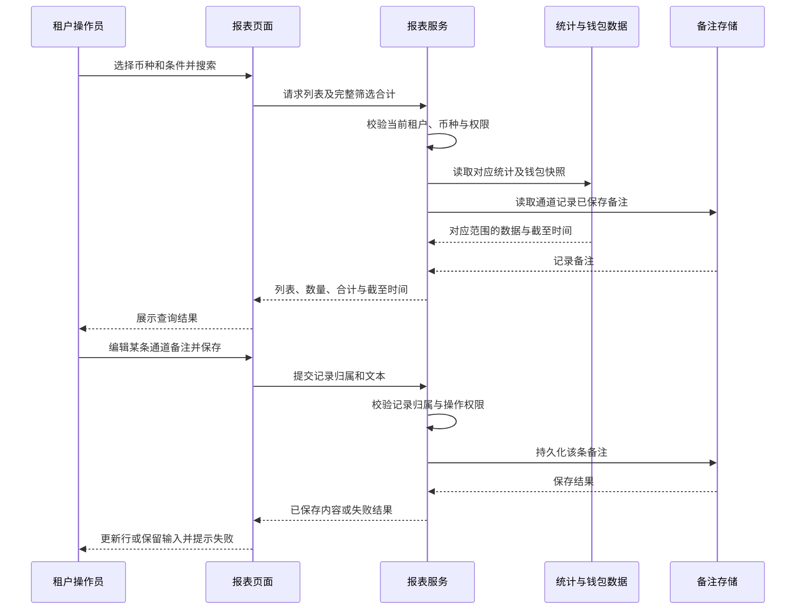
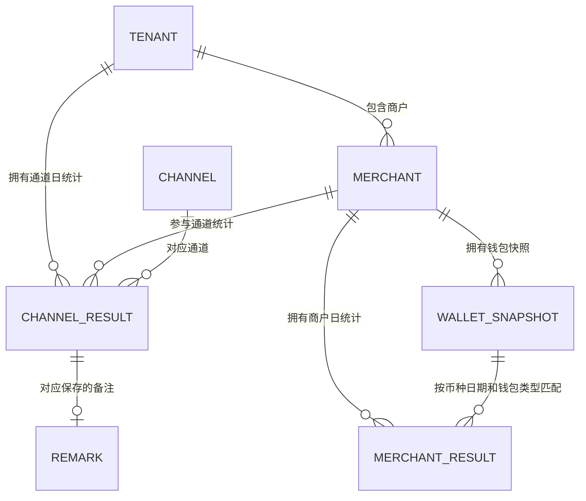

# 租户端日终统计报表附录

主文件：[PRD_租户端日终统计报表_20261005](PRD_%E7%A7%9F%E6%88%B7%E7%AB%AF%E6%97%A5%E7%BB%88%E7%BB%9F%E8%AE%A1%E6%8A%A5%E8%A1%A8_20261005.md)。

## 目录

- [A2 目标用户与角色](#a2-%E7%9B%AE%E6%A0%87%E7%94%A8%E6%88%B7%E4%B8%8E%E8%A7%92%E8%89%B2)
- [A3 资料流与系统串接](#a3-%E8%B5%84%E6%96%99%E6%B5%81%E4%B8%8E%E7%B3%BB%E7%BB%9F%E4%B8%B2%E6%8E%A5)
- [A4 非功能性要求](#a4-%E9%9D%9E%E5%8A%9F%E8%83%BD%E6%80%A7%E8%A6%81%E6%B1%82)
- [A7 后台业务边界](#a7-%E5%90%8E%E5%8F%B0%E4%B8%9A%E5%8A%A1%E8%BE%B9%E7%95%8C)
- [A9 开发核对事项](#a9-%E5%BC%80%E5%8F%91%E6%A0%B8%E5%AF%B9%E4%BA%8B%E9%A1%B9)
- [A10 名词定义](#a10-%E5%90%8D%E8%AF%8D%E5%AE%9A%E4%B9%89)
- [A11 相关资源](#a11-%E7%9B%B8%E5%85%B3%E8%B5%84%E6%BA%90)

## A2 目标用户与角色

| 使用者 | 用途 | 边界 |
|---|---|---|
| 当前租户已授权运营账号 | 查看通道或商户交易结果，执行获授权的备注操作 | 仅当前租户的数据 |
| 当前租户已授权财务账号 | 查看钱包日终快照和获授权的报表导出 | 只读钱包，不在报表办理资金业务 |
| 其他已授权租户账号 | 按既有角色权限使用报表 | 不因本期新增入口自动扩大授权 |

角色名称仅说明使用场景，不构成对某角色的默认授权。查看、备注编辑和导出映射至既有报表权限规则；映射不明确时按 A9 核对。

## A3 资料流与系统串接

### A3.1 查询、钱包与备注资料流

### A3.2 接入约束

- 蓝盛提供交易指标算法参考；四页的状态集合、日期归属及计算过程逐页核对，不自行统一改写。
- 汇盛提供当前租户、商户、通道、有效币种及角色权限范围。
- 商户钱包数据独立读取该商户、该币种、该业务钱包的日快照；不读取租户平台钱包代替。
- 列表、合计与导出使用一致的已应用查询条件；导出遍历完整结果，不仅取当前页。
- 备注提交必须校验服务端记录归属，不能以页面行号、姓名或通道名称作为唯一身份。
- 具体接口、存储结构、批量大小与任务处理方式由研发按现有工程确定，本文件不指定新增接口路径或物理表。

## A4 非功能性要求

| 方面 | 实施与验收要求 |
|---|---|
| 租户隔离 | 服务端确认当前账号租户；修改查询或记录标识也不能跨租户查看、保存备注或导出 |
| 币种隔离 | 当前币种贯穿列表、明细、合计、备注归属及导出，不跨币种汇总或换算 |
| 权限 | 接入现有查看、备注操作与导出授权规则；前端隐藏入口不能代替服务端校验 |
| 金额精度 | 沿用各币种现有存储及展示精度；汇总使用原始精确金额，不重新汇总已截断显示值 |
| 文本安全 | 备注按文本展示；导出处理引号、换行、分隔符及公式前缀，避免文本被执行 |
| 持久性 | 正式备注保存后可刷新／重新进入读取；统计重新生成不能覆盖人工备注 |
| 查询一致性 | 处理切币种、改筛选及分页的迟到响应，当前页面不得展示过期请求结果 |
| 可操作性 | 长表支持横向滚动；弹窗长内容可访问；键盘可切 Tab、输入、保存、取消及关闭 |
| 失败处理 | 查询失败不作为零条；快照读取失败不作为零余额；备注失败不改变已保存内容 |
| 性能 | 继承汇盛既有报表查询与导出容量标准；本期不虚设响应时限或最大导出条数 |
| 审计 | 备注及导出操作接入现有审计规范，不由本需求另设保留期限或默认角色 |

## A7 后台业务边界

### A7.1 授权矩阵

| 授权条件 | 查看列表／合计／钱包明细 | 编辑通道备注 | 导出 |
|---|---|---|---|
| 有当前租户报表查看授权 | 可按授权范围查看 | 另按既有备注操作规则判断 | 另按既有导出规则判断 |
| 有备注操作授权且记录属于当前租户 | 同时满足查看规则 | 可保存或清空该条备注 | 不因此自动取得导出授权 |
| 有导出授权且查询范围合法 | 同时满足查看规则 | 不因此自动取得备注操作授权 | 可导出完整筛选结果 |
| 不属于当前租户或币种不在有效范围 | 不可 | 不可 | 不可 |

- 具体角色与权限映射需核对现有实现，不为运营、财务或其他角色自动授予新权限。
- 该矩阵表达校验条件，不要求建立三套新权限或新的审批流程。

### A7.2 数据归属

| 对象 | 归属与粒度 |
|---|---|
| 通道日统计 | 租户 + 业务方向 + 币种 + 日期 + 商户 + 通道 |
| 商户日统计 | 租户 + 业务方向 + 币种 + 日期 + 商户 |
| 钱包快照 | 商户所有者 + 币种 + 钱包类型 + 统计日期／截至时点 |
| 通道备注 | 对应的一条通道日统计记录；允许为空 |

### A7.3 业务关系图

以下仅表达业务关系，不指定物理数据表、字段类型或接口结构。

### A7.4 操作范围

- 批量能力仅为完整筛选导出；本期不增加批量备注、批量资金处理或报表审批。
- 钱包明细只读，备注只改变统计记录注释；不会生成资金流水或调整钱包。
- 移除页面入口不删除历史统计、资金流水、工单或审计事实。

## A9 开发核对事项

| 核对项 | 处理方式 | 交付证据 |
|---|---|---|
| 蓝盛四页指标与日期计算 | 逐页查看源码，核对状态集合、分母、金额与统计日期归属；不另请产品定义成交率分母 | 对应代码位置、汇盛字段映射及对照样本 |
| 正式币种清单、初始币种、精度 | 取租户现有有效币种及默认、精度规则；Demo 四币种只作示例 | 配置来源及各币种查询样本；若现有规则不明确再提出确认 |
| 商户钱包历史和今日快照 | 确认期初、期末、冻结、可用可按同一归属和时点取得 | 快照来源、截至时间及历史／今日核对样本 |
| 备注操作授权、长度与冲突处理 | 沿用蓝盛备注及汇盛报表规范；无既有规则时提出确认，不默认为全员开放或自行增加审批 | 对应规则与保存失败／冲突的处理说明 |
| 查询和导出容量 | 沿用汇盛当前报表标准，不在需求中猜测上限或时限 | 既有标准与满足该标准的测试结果 |

## A10 名词定义

| 名词 | 本需求含义 |
|---|---|
| 日终统计 | 按 UTC+8 日期展示的交易统计；今日显示截至查询时结果 |
| 成交金额／成交率 | 蓝盛对应页面的业务统计指标，不使用 Demo 样例反推 |
| 未支付 | 商户代付统计中的单量指标，状态集合沿用蓝盛 |
| 未成交金额 | 商户代付统计中的金额指标，状态集合沿用蓝盛 |
| 钱包总额 | 对应商户、币种、钱包类型在快照时点的总额 |
| 钱包可用余额 | 同时点总额减冻结金额 |
| 完整筛选结果 | 当前币种与已应用条件下的所有记录，覆盖所有分页 |
| 备注 | 一条通道日统计记录的运营文本注释，不参与交易与钱包计算 |

## A11 相关资源

- [PRD_租户端日终统计报表_20261005](PRD_%E7%A7%9F%E6%88%B7%E7%AB%AF%E6%97%A5%E7%BB%88%E7%BB%9F%E8%AE%A1%E6%8A%A5%E8%A1%A8_20261005.md)
- [开发任务清单](%E5%BC%80%E5%8F%91%E4%BB%BB%E5%8A%A1%E6%B8%85%E5%8D%95.md)
- [开发补充说明](%E5%BC%80%E5%8F%91%E8%A1%A5%E5%85%85%E8%AF%B4%E6%98%8E.md)
- [汇盛本地统一 Demo](https://jeffcity.github.io/huisheng-pay-demo/#tenant)
- [蓝盛日终统计参考入口](https://lsweb2.newopsname.com/report/collection-channel-daily-summary)：需使用已获授权的后台账号；从日终数据统计菜单查看对应四页。
- [README](README.md)：当前需求范围与本地 Demo 位置。
